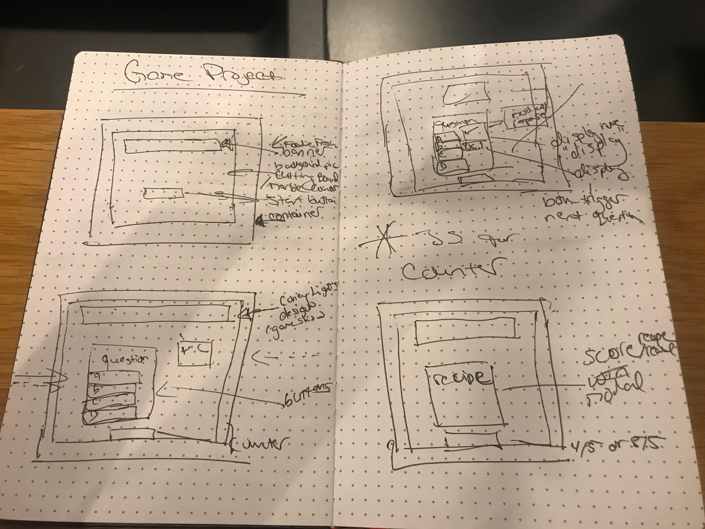

*** Luz Diaz 10/05/17 ***

# Foodie Fresh Proposal

## What is Foodie Fresh?

Pop up pictures of healthy, widely-used, but somewhat unfamiliar ingredients. Player attempts to identify the ingredients. There will be five categories, with five questions each.  The questions will become increasingly challenging based on the obscurity of the ingredient.  The win reward  (result correct 4/5 or higher) will be an alert with a recipe.  The loss (3/5 or lower) reward will be an article on the ingredient.   The goal is to both intrigue and inspire people to open or expand their palate. 
I chose this game because I have had an interest in the culinary arts and have been  cooking since I was five years old; I explore foodie events with my friends on a regular basis.

## Wireframe

## Initial thoughts on game structure

I expect to create a very simple but visually appealing multiple choice game that will both educate and entice the player.
JS - I will use the same if-then statement throughout for each question.  i.e. The same 5 choices will appear for each question of the category but the answer will change depending on the question.  
I have significant challenges connecting the JS to the CSS actions I would like.  Also I have trouble with counter variables/functions specifically the arrays.

Using jquery, I love the ease, and the logic/syntax is clearer for me but I have had significantly less experience with this library.
Using a math randomizer to vary the win/loss modals. 
I would like the end result to be that a player will leave hungry and try a new recipe or a new dish at a restaurant.

## Phases of Completion

Friday: Phase 1 - research & archive  pictures/ articles/recipes.
Saturday : Phase 2 - work on HTML frame and all the JS if-else/ functions.
Sunday: Phase 3 - JS/CSS 
Monday: Phase 4 - JS/CSS animations
Tuesday: Phase 5 - JS/test the site
Wednesday: Phase 6 – JS/present the site to classmates squad leader

## Links and Resources

1)	http://www.geniuskitchen.com/
2)	http://www.foodnetwork.com/
3)	https://www.epicurious.com/
4)	https://www.marthastewart.com/1505788/recipes
5)	https://eat24hours.com/
6)	https://giphy.com/

Acceptance Criteria
- When I’m on the home screen 
I see a banner with the name of the game a cutting board or marble counter.  Player ready message “test your foodie knowledge” and a start button
- When I click start button 
	a picture and multiple choice question appear. The counter panel appears
- I make a selection and
I see a checkmark or x-mark appear. If correct the counter goes up by one. Next question appears after 2 seconds. (Repeat 4x)
- I answer last question and 
the counter displays the total score, if  correct  4/5 or higher, a modal with a recipe appears.  If correct 3/5 or less, a “learn more” article appears.
